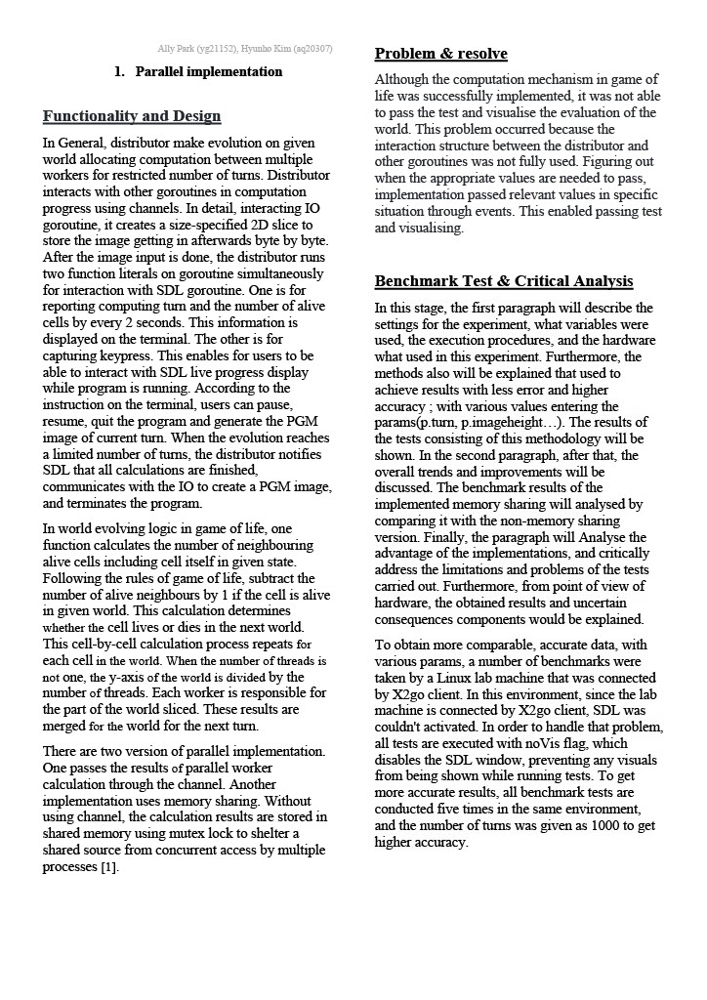
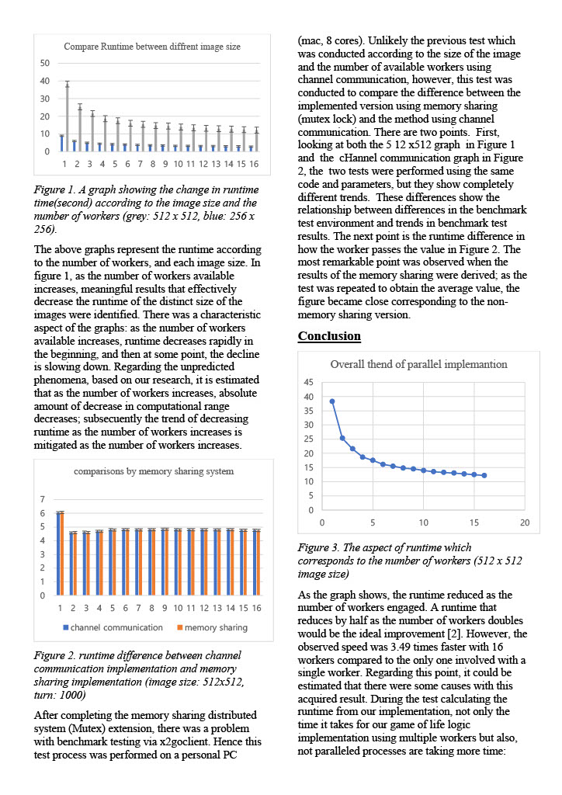
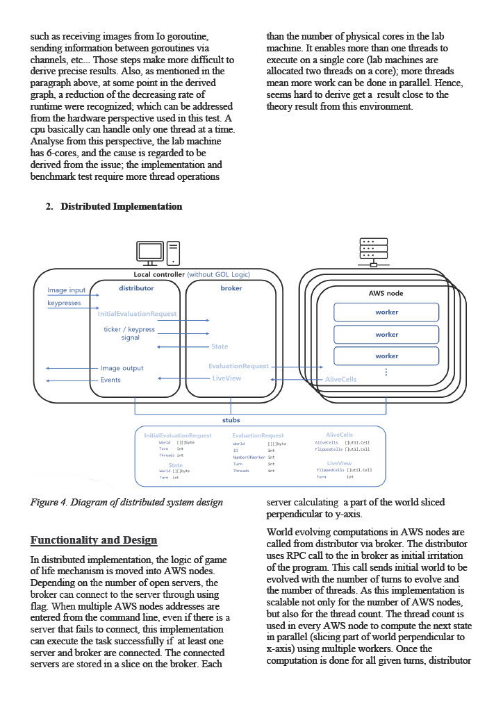
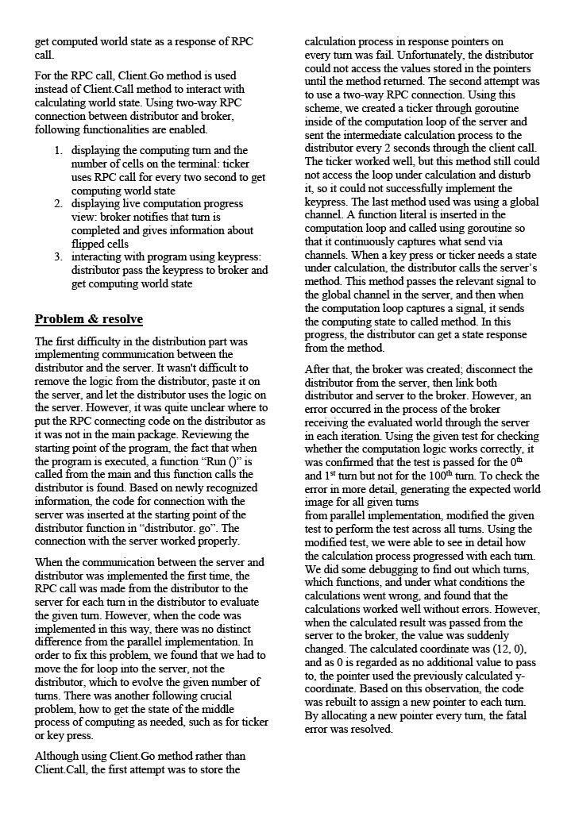
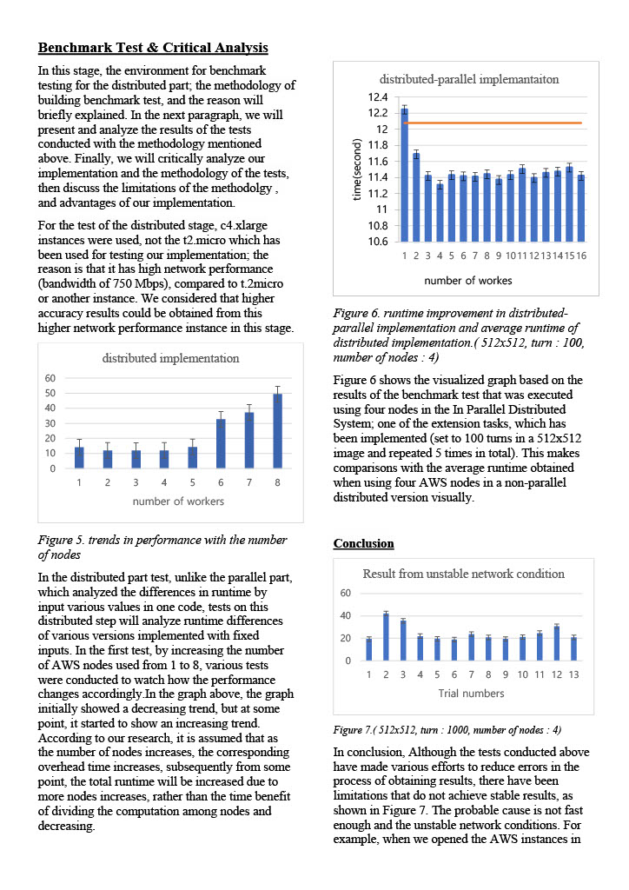
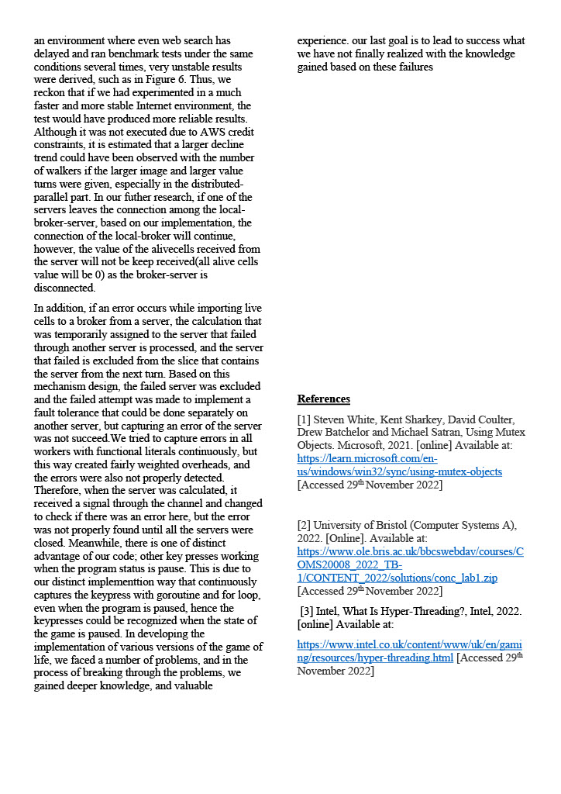

# Conway's Game of Life Simulation

This project is an optimised simulation of Conway's Game of Life, implemented in Go (Golang). Conway's Game of Life is a cellular automaton devised by mathematician John Horton Conway. It simulates the evolution of a grid of cells based on simple rules, determining whether cells live, die, or reproduce.

For the full report, you can also [download it here](./doc/report.pdf).
 
